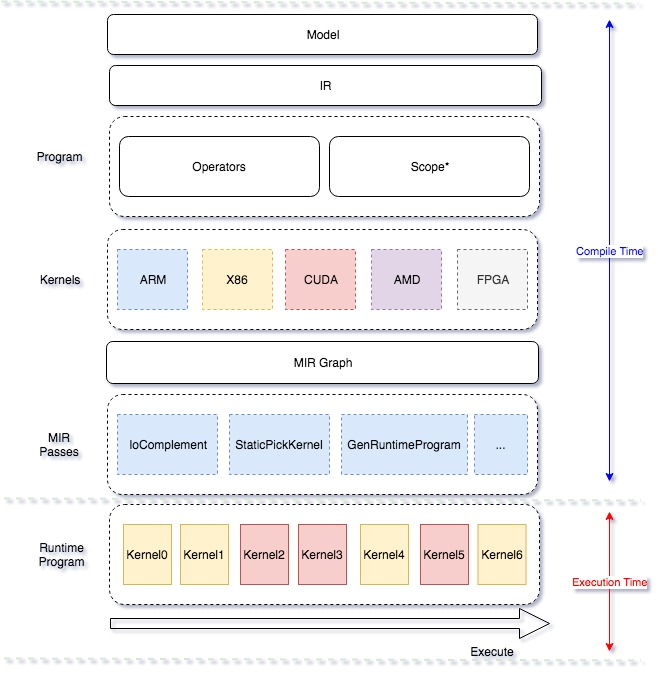

# 开发者文档

## 基本概念

### Place

`Place`类确定了kernel运行时的上下文信息，其中包含了kernel运行时所在的平台，执行运算数据的精度以及数据的布局等信息，使得MIR的分析更加清晰准确。它主要的成员变量如下：

* `TargetType target`: kernel运行时所在的平台，如X86/CUDA/ARM等；
* `PrecisionType precision`: kernel执行运算的数据的精度，如Float, Int8, Fp16等；
* `DataLayoutType layout`: kernel执行运算的数据的布局，如NCHW, NHWC等；

### OpLite

`Oplite`类负责协助kernel计算，本身不具备计算功能，主要的接口功能包括：

* `CheckShape`: 用于检查op的输入/输出参数维度、类型是否合法，以及属性信息是否符合设计；
* `InferShape`: 用于设置输出Tensor的形状信息；
* `CreateKernels`:  创建相关的kernel;
* `Attach`: 用于从`Scope`和`OpDesc`中获取参数的指针，并传递给kernel;

重要方法及声明如下：

```c++
class OpLite : public Registry {
 public:
  OpLite() = default;
  explicit OpLite(const std::string &type) : op_type_(type) {}
  explicit OpLite(const std::vector<Place> &valid_places)
      : valid_places_(valid_places) {}

  void SetValidPlaces(const std::vector<Place> &places) {
    VLOG(3) << "valid places " << valid_places_.size();
    valid_places_ = places;
  }
  // Set supported places
  const std::vector<Place> &valid_places() const { return valid_places_; }
  // Check the shape.
  virtual bool CheckShape() const { return true; }
  // Inference the outputs' shape.
  virtual bool InferShape() const { return true; }
  // Run this operator.
  virtual bool Run();

  // Link the external execution environ to internal context.
  bool Attach(const cpp::OpDesc &opdesc, lite::Scope *scope);

  // Create all the kernels for the valid targets.
  std::vector<std::unique_ptr<KernelBase>> CreateKernels(
      const std::vector<Place> &places, const std::string &kernel_type = "");

  // Assign op param to kernel.
  virtual void AttachKernel(KernelBase *kernel) = 0;
};
```

### KernelLite

为了提升kernel对`Target`, `Precision`, `DataLayout`等多种执行模式的支持，引入了`KernelLite`的概念，它主要有以下特点：

* 可以通过模版特化不同`Place`和kernel的实现，加强对不同执行模式的支持；
* 轻量级，`KernelLite`类似functor，只有执行的职能，执行效率更高；
* 每个kernel有明确执行的模式，并且可以在analysis time参与分析；
* 依赖简单，便于部署到mobile执行；
* 硬件调度信息等`context`跟具体的kernel绑定，方便定制不同kernel的行为。

重要的方法及声明如下：

```c++
template <TargetType Target, PrecisionType Precision,
          DataLayoutType DataLayout = DataLayoutType::kNCHW>
class KernelLite : public KernelBase {
 public:
  // Run the kernel.
  virtual void Run() { CHECK(false) << "Not Implemented"; }
  // Set target
  TargetType target() const override { return Target; }
  // Set precision
  PrecisionType precision() const override { return Precision; }
  // Set data layout
  DataLayoutType layout() const override { return DataLayout; }
  Place place() const override { return Place{Target, Precision, DataLayout}; }
  void Touch() {}

  KernelLite() = default;
  virtual ~KernelLite() = default;
};
```


## 架构简介

Mobile 在这次升级为 lite 架构， 侧重多硬件、高性能的支持，其主要设计思想如下

- 引入 Type system，强化多硬件、量化方法、data layout 的混合调度能力
- 硬件细节隔离，通过不同编译开关，对支持的任何硬件可以自由插拔
- 引入 MIR(Machine IR) 的概念，强化带执行环境下的优化支持
- 优化期和执行期严格隔离，保证预测时轻量和高效率

架构图如下




## 增加新 Kernel的方法

下面主要介绍op新增kernel如何写，简单总结新增kernel的实现需要包含如下内容：

- kernel实现：继承自`KernelLite`类的对应op的Compute类定义与实现，根据输入的数据类型，数据布局，数据所在的设备以及运行时所调用的第三方库的不同实现不同的kernel；server端CPU kernel实现在.h文件中。
- kernel注册：server端CPU kernel注册实现在.cc文件。

## 实现C++类

以mul op的CPU Kernel实现为例，mul kernel执行运算的矩阵乘法的公式为*Out* = *X* * *Y*,  可见该计算由两个输入，一个输出组成; 输入输出参数分别从OP的param中获取，如mul op的param定义如下：

```c++
struct MulParam {
  const lite::Tensor* x{};
  const lite::Tensor* y{};
  lite::Tensor* output{};
  int x_num_col_dims{1};
  int y_num_col_dims{1};
};
```

下面开始定义`MulCompute`类的实现：

```c++
template <typename T>
class MulCompute : public KernelLite<TARGET(kX86), PRECISION(kFloat)> {
 public:
  using param_t = operators::MulParam;

  void Run() override {
    auto& context = ctx_->As<X86Context>();
    auto& param = *param_.get_mutable<operators::MulParam>();
    CHECK(context.x86_device_context());
    
    //1. 为output分配内存
    param.output->template mutable_data<T>();

    // 2. 获取计算用的输入输出
    auto* x = &param.x->raw_tensor();
    auto* y = &param.y->raw_tensor();
    
    auto* z = &param.output->raw_tensor();
    
    //3. 对输入输出数据进行需要的处理...
    Tensor x_matrix, y_matrix;
    if (x->dims().size() > 2) {
      x_matrix = framework::ReshapeToMatrix(*x, param.x_num_col_dims);
    } else {
      x_matrix = *x;
    }

    //4. 调用数学库进行矩阵的运算... 
    auto blas = paddle::operators::math::GetBlas<platform::CPUDeviceContext, T>(
        *context.x86_device_context());

    blas.MatMul(x_matrix, y_matrix, z);
  }

  virtual ~MulCompute() = default;
};
```

`MulCompute`类继承自`kernelLite`, 带有下面两个模版参数：

- `TARGET(kX86)`: `Target`代表的是硬件信息，如CUDA/X86/ARM/…，表示该kernel运行的硬件平台，在该示例中我们写的是kX86，表示mul这个kernel运行在X86平台上； 

- `PRECISION(kFloat)`：`Precision`代表该kernel运算支持的数据精度信息，示例中写的是`kFloat`, 表示mul这个kernel支持Float数据的运算；

  需要为`MulCompute`类重写`Run`接口， kernel 的输入和输出分别通过`MulParam`获得，输入/输出的变量类型是`lite::Tensor`。

到此，前向mul kernel的实现完成，接下来需要在.cc文件中注册该kernel。

## 注册kernel

在.cc文件中注册实现的kernel：

```c++
REGISTER_LITE_KERNEL(mul, kX86, kFloat, kNCHW,
                     paddle::lite::kernels::x86::MulCompute<float>, def)
    .BindInput("X", {LiteType::GetTensorTy(TARGET(kX86))})
    .BindInput("Y", {LiteType::GetTensorTy(TARGET(kX86))})
    .BindOutput("Out", {LiteType::GetTensorTy(TARGET(kX86))})
    .Finalize();
```

在上面的代码中；

- `REGISTER_LITE_KERNEL`: 注册MulCompute类，并特化模版参数为float类型， 类型名为mul, 运行的平台为X86, 数据精度为float, 数据布局为NCHW；
- 在运行时，框架系统根据输入数据所在的设备，输入数据的类型，数据布局等信息静态的选择合适的kernel执行运算。

## 增加新硬件支持的方法

@chunwei

## 开发环境

### Mobile端开发和测试

我们提供了移动端开发所需的docker镜像环境，在`paddle/fluid/lite/tools/Dockerfile.mobile`，可以直接通过
`docker build --file paddle/fluid/lite/tools/Dockerfile.mobile --tag paddle-lite-mobile:latest . `生成镜像文件。

该镜像中提供了
 - Android端的交叉编译环境
 - ARM Linux端的交叉编译环境
 - Android端的模拟器环境
 - 开发所需的格式检查工具

#### 相关的cmake选项

目前支持如下的编译配置，以生成不同目标上的程序。

- `ARM_TARGET_OS` 代表目标操作系统， 目前支持 "android" "armlinux"， 默认是Android
- `ARM_TARGET_ARCH_ABI` 代表ARCH，支持输入"armv8"和"armv7"，针对OS不一样选择不一样。
    - `-DARM_TARGET_OS="android"` 时 
        - "armv8", 等效于 "arm64-v8a"。 default值为这个。
        - "armv7", 等效于 "armeabi-v7a"。 
    - `-DARM_TARGET_OS="armlinux"` 时 
        - "armv8", 等效于 "arm64"。 default值为这个。
        - "armv7hf", 等效于使用`eabihf`且`-march=armv7-a -mfloat-abi=hard -mfpu=neon-vfpv4 `。
        - "armv7", 等效于使用`eabi`且`-march=armv7-a -mfloat-abi=softfp -mfpu=neon-vfpv4`。
- `ARM_TARGET_LANG` 代表目标编译的语言， 默认为gcc，支持 gcc和clang两种。

Note: ARM Linux当前仅支持在armv8上编译并测试。

#### 开发

添加新的ARM端kernel，主要分为3部分：
1. 添加具体的数学计算，在`paddle/fluid/lite/arm/math`中添加对应的数学函数，侧重点在于代码本身的优化，充分利用NEON指令发挥其优势。
2. 添加kernel声明和调用实例，在`paddle/fluid/lite/kernels/arm`中添加对应kernel的框架声明和调用，侧重点在于每种kernel严格对应输入输出的类型。
3. 添加单元测试，在`paddle/fluid/lite/kernels/arm`中添加相应的单元测试，并保持其在模拟器或者真机中可以通过。

#### 测试

我们在镜像开发环境中添加了`arm64-v8a`和`armeabi-v7a`的Android模拟环境，在没有真机环境下，可以很方便的用于测试在对应平台上的单元测试。

常用步骤如下

```shell
# 创建Android avd (armv8)
$ echo n | avdmanager create avd -f -n paddle-armv8 -k "system-images;android-24;google_apis;arm64-v8a"

# 启动Android armv8 emulator
$ ${ANDROID_HOME}/emulator/emulator -avd paddle-armv8 -noaudio -no-window -gpu off -verbose &

# 其他正常测试步骤

# 关闭所有模拟器
$ adb devices | grep emulator | cut -f1 | while read line; do adb -s $line emu kill; done
```

